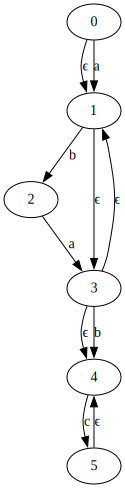

# Theoretical exercises: Regular languages, NFAs and DFAs

## Task 1

• The letter a is always followed by either b or c
• The letter b is always followed by either a or c
• The letter c is always followed by either another c, or the end of the string

Possible regexes:
• a?(ba)*b?c+
• b?(ab)*a?c+

## Task 2

`Mc-Naughton–Yamada–Thompson algorithm`

a?(ba)*b?c+ --> NFA

## Task 3

NFA --> DFA

## Task 4

